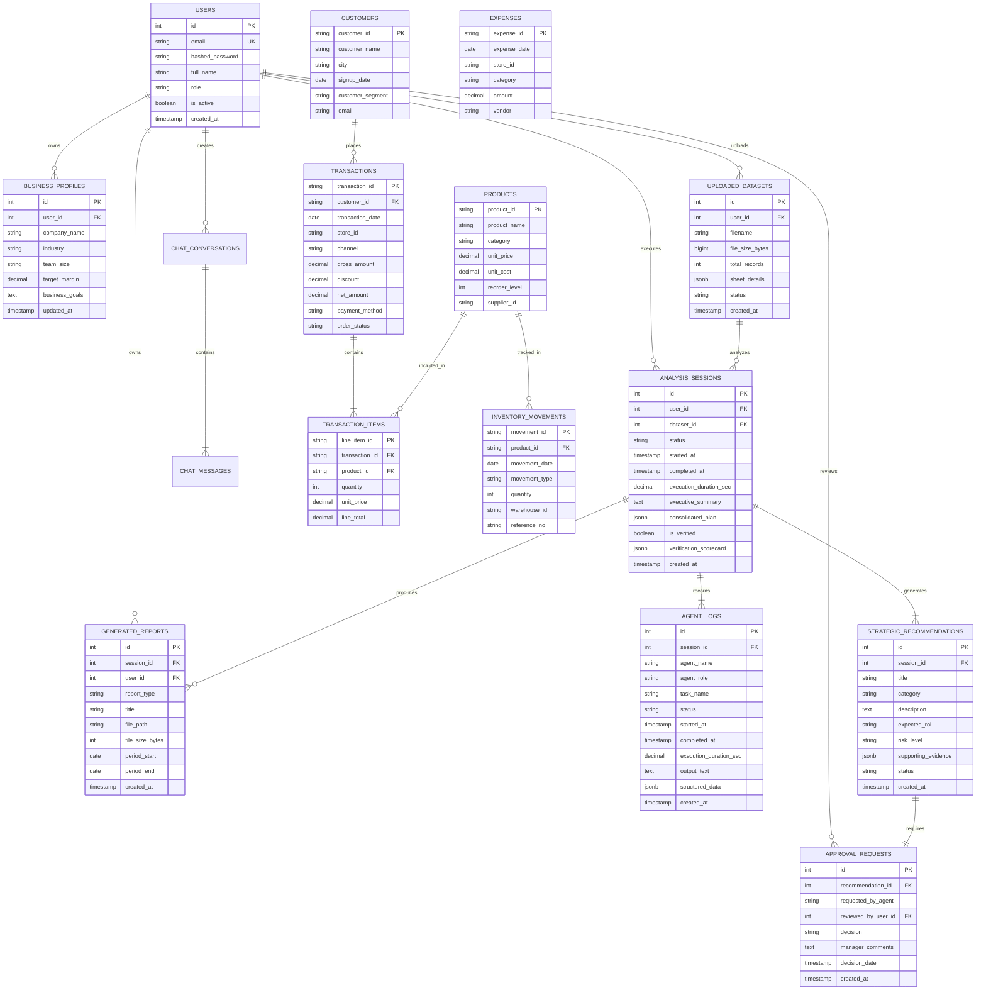

# Database Entity Relationship (ER) Diagram

**Document Reference:** ERD-RET-2026-V1  
**Target Environment:** PostgreSQL Live on Render / Local Development  

---

```mermaid
erDiagram
    USERS ||--o{ BUSINESS_PROFILES : owns
    USERS ||--o{ UPLOADED_DATASETS : uploads
    USERS ||--o{ ANALYSIS_SESSIONS : executes
    USERS ||--o{ APPROVAL_REQUESTS : reviews
    USERS ||--o{ GENERATED_REPORTS : owns
    USERS ||--o{ CHAT_CONVERSATIONS : creates

    CHAT_CONVERSATIONS ||--|{ CHAT_MESSAGES : contains

    UPLOADED_DATASETS ||--o{ ANALYSIS_SESSIONS : analyzes

    ANALYSIS_SESSIONS ||--|{ AGENT_LOGS : records
    ANALYSIS_SESSIONS ||--|{ STRATEGIC_RECOMMENDATIONS : generates
    ANALYSIS_SESSIONS ||--o{ GENERATED_REPORTS : produces

    STRATEGIC_RECOMMENDATIONS ||--|| APPROVAL_REQUESTS : requires

    CUSTOMERS ||--o{ TRANSACTIONS : places
    TRANSACTIONS ||--|{ TRANSACTION_ITEMS : contains
    PRODUCTS ||--o{ TRANSACTION_ITEMS : included_in
    PRODUCTS ||--o{ INVENTORY_MOVEMENTS : tracked_in

    USERS {
        int id PK
        string email UK
        string hashed_password
        string full_name
        string role
        boolean is_active
        timestamp created_at
    }

    BUSINESS_PROFILES {
        int id PK
        int user_id FK
        string company_name
        string industry
        string team_size
        decimal target_margin
        text business_goals
        timestamp updated_at
    }

    UPLOADED_DATASETS {
        int id PK
        int user_id FK
        string filename
        bigint file_size_bytes
        int total_records
        jsonb sheet_details
        string status
        timestamp created_at
    }

    ANALYSIS_SESSIONS {
        int id PK
        int user_id FK
        int dataset_id FK
        string status
        timestamp started_at
        timestamp completed_at
        decimal execution_duration_sec
        text executive_summary
        jsonb consolidated_plan
        boolean is_verified
        jsonb verification_scorecard
        timestamp created_at
    }

    AGENT_LOGS {
        int id PK
        int session_id FK
        string agent_name
        string agent_role
        string task_name
        string status
        timestamp started_at
        timestamp completed_at
        decimal execution_duration_sec
        text output_text
        jsonb structured_data
        timestamp created_at
    }

    STRATEGIC_RECOMMENDATIONS {
        int id PK
        int session_id FK
        string title
        string category
        text description
        string expected_roi
        string risk_level
        jsonb supporting_evidence
        string status
        timestamp created_at
    }

    APPROVAL_REQUESTS {
        int id PK
        int recommendation_id FK
        string requested_by_agent
        int reviewed_by_user_id FK
        string decision
        text manager_comments
        timestamp decision_date
        timestamp created_at
    }

    GENERATED_REPORTS {
        int id PK
        int session_id FK
        int user_id FK
        string report_type
        string title
        string file_path
        int file_size_bytes
        date period_start
        date period_end
        timestamp created_at
    }

    CUSTOMERS {
        string customer_id PK
        string customer_name
        string city
        date signup_date
        string customer_segment
        string email
    }

    PRODUCTS {
        string product_id PK
        string product_name
        string category
        decimal unit_price
        decimal unit_cost
        int reorder_level
        string supplier_id
    }

    TRANSACTIONS {
        string transaction_id PK
        string customer_id FK
        date transaction_date
        string store_id
        string channel
        decimal gross_amount
        decimal discount
        decimal net_amount
        string payment_method
        string order_status
    }

    TRANSACTION_ITEMS {
        string line_item_id PK
        string transaction_id FK
        string product_id FK
        int quantity
        decimal unit_price
        decimal line_total
    }

    INVENTORY_MOVEMENTS {
        string movement_id PK
        string product_id FK
        date movement_date
        string movement_type
        int quantity
        string warehouse_id
        string reference_no
    }

    EXPENSES {
        string expense_id PK
        date expense_date
        string store_id
        string category
        decimal amount
        string vendor
    }
```
